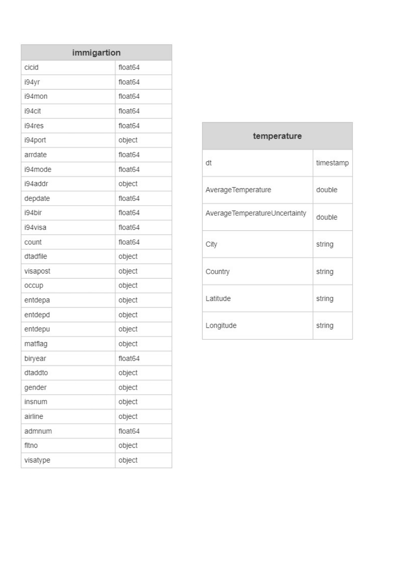

# Introduction
Today, 1% of the world is a barely livable hot zone. By 2070, that portion could go up to 19%.Billions of people call this land home. Where will they go? we will help the countries and governments to understand the basic relation between the climate change and the immigration issue. In this project we will use some important datasets related to immigration process and the temperature with the world. We will use some useful data engineering tools like data warehouses, AWS S3, Spark, Apache Airflow and AWS Warehouse like Redshift to deal with those datasets and try to indicates to the concerned people how the weather change and temperature is a important factor to the immigration process.

# Steps
The project follows the follow steps:

<li><a href="#s1">Step 1: Scope the Project and Gather Data</a>
<li><a href="#s2">Step 2: Explore and Assess the Data</a>
<li><a href="#s3">Step 3: Define the Data Model</a>
<li><a href="#s4">Step 4: Run ETL to Model the Data</a>
<li><a href="#s5">Step 5: Complete Project Write Up</a>

# Datasets
- 1- I94 Immigration dataset: This data comes from the US National Tourism and Trade Office. A data dictionary is included in the workspace.  [This](https://www.trade.gov/national-travel-and-tourism-office) is where the data comes from. 

- 2- World Temperature dataset: This dataset came from Kaggle. You can read more about it [here](https://www.kaggle.com/berkeleyearth/climate-change-earth-surface-temperature-data).
    
    
# Steps 
To help guide the project, we've broken it down into a series of steps.
    
<h3>Step 1: Scope the Project and Gather Data</h3>
    
#### Scope
    
In this project we will use  some important datasets related to immigration process and the temperature with the world. We will use some usful data enginnering tools like data werehouses,AWS  S3,  Spark, Apache Airflow and AWS Warehouse like Redshif
    

## <h3> Step 2: Explore and Assess the Data </h3>
Explore the data to identify data quality issues, like missing values, duplicate data, etc.
    
## <h3>Step 3: Define the Data Model</h3>
#### 3.1 Conceptual Data Model
We will use the star schema data model because we could easily work on it by create and join tables.
the following image indicates the star schema diagram:
    

#### 3.2 Mapping Out Data Pipelines
the steps necessary to pipeline the data.

- 1- Upload the data into the S3 Redshift.
- 2- use Apache Airflow to perform the data pipelines.
- 3- Load Fact Operator
- 4- Data Quality check
- 5- End dummy operator

which will be found here [Airflow](https://github.com/abdallah-elsawy/Data-Engineering-Capstone-Project/tree/main/Airflow) folder
    
## <h3>Step 4: Run ETL to Model the Data</h3>
    
#### 4.1 Create the data model
we will find that here [Capstone Project](https://github.com/abdallah-elsawy/Data-Engineering-Capstone-Project/blob/main/Capstone%20Project.ipynb)
    
#### 4.2 Data Quality Checks
we will find that here [data_quality](https://github.com/abdallah-elsawy/Data-Engineering-Capstone-Project/blob/main/Airflow/plugins/operators/data_quality.py)

   
    
## <h3> Step 5: Complete Project Write Up  </h3>
### Tools and technologies for the project.
     
     - Spark
     - AWS S3
     - Apache Airflow 
     - AWS Warehouse like Redshift 

### How often the data should be updated and why.
     
     - Should be updated Monthly Should be updated Monthly because the data is formed monthly.
     
### How we will deal with those differently under the following scenarios:
#### The data was increased by 100x.
      - Use partitioning  of the data or use AWS EMR
#### The data populates a dashboard that must be updated on a daily basis by 7am every day.
      - We should use Apache Airflow  to updated dashboard daily.
#### The database needed to be accessed by 100+ people.
      - Use partitioning to give the ability to all users to access the data quickly

    
    
    
#### 4.3 Data dictionary 

- 1- I94 Immigration dataset: 
- 2- World Temperature dataset :
    
    
   
    
##### immigration
    
<table class="tg" align="left">
  <tr>
    <th class="tg-0pky">Column Name</th>
    <th class="tg-0pky">Description</th>
  </tr>
 <tr><td class="tg-0pky">CICI </td><td class="tg-0pky">Primary Key Unique ID</td></tr>
 <tr><td class="tg-0pky">i94yr</td><td class="tg-0pky"> year</td></tr>
 <tr><td class="tg-0pky">i94mon</td><td class="tg-0pky"> month</td></tr>
 <tr><td class="tg-0pky">i94port</td><td class="tg-0pky">Port of admission</td></tr>
 <tr><td class="tg-0pky">arrdate</td><td class="tg-0pky">Arrival Date</td></tr>
 <tr><td class="tg-0pky">i94mode</td><td class="tg-0pky">Mode of transportation</td></tr>
 <tr><td class="tg-0pky">i94addr</td><td class="tg-0pky">USA State of arrival</td></tr>
 <tr><td class="tg-0pky">depdate</td><td class="tg-0pky">Departure Date </td></tr>
 <tr><td class="tg-0pky">i94bir</td><td class="tg-0pky">Age of birth</td></tr>
 <tr><td class="tg-0pky">i94visa</td><td class="tg-0pky">Visa codes </td></tr>
 <tr><td class="tg-0pky">count</td><td class="tg-0pky">count</td></tr>
 <tr><td class="tg-0pky">dtadfile</td><td class="tg-0pky">Character string </td></tr>
 <tr><td class="tg-0pky">visapost</td><td class="tg-0pky">Department of State</td></tr>
 <tr><td class="tg-0pky">occup</td><td class="tg-0pky">Occupation </td></tr>
 <tr><td class="tg-0pky">entdepa</td><td class="tg-0pky">Arrival Flag </td></tr>
 <tr><td class="tg-0pky">entdepd</td><td class="tg-0pky">Departure Flag </td></tr>
 <tr><td class="tg-0pky">entdepu</td><td class="tg-0pky">Update Flag </td></tr>
 <tr><td class="tg-0pky">matflag</td><td class="tg-0pky">Match flag </td></tr>
 <tr><td class="tg-0pky">biryear</td><td class="tg-0pky">year of birth</td></tr>
 <tr><td class="tg-0pky">visatype</td><td class="tg-0pky">visa type</td></tr>
 <tr><td class="tg-0pky">dtaddto</td><td class="tg-0pky">how long stay</td></tr>
 <tr><td class="tg-0pky">gender</td><td class="tg-0pky">sex</td></tr>
 <tr><td class="tg-0pky">airline</td><td class="tg-0pky">airline</td></tr>
</table>
 

##### temperature
<table class="tg" align="left">
  <tr>
    <th class="tg-0pky">Column Name</th>
    <th class="tg-0pky">Description</th>
  </tr>
 <tr><td class="tg-0pky">Code </td><td class="tg-0pky">Country Code</td></tr>
 <tr><td class="tg-0pky">Country</td><td class="tg-0pky"> Country Name</td></tr>
 <tr><td class="tg-0pky">AverageTemperature</td><td class="tg-0pky"> Temperature of the country between 1743 and 2013</td></tr>
 <tr><td class="tg-0pky">Latitude</td><td class="tg-0pky">GPS coordinates</td></tr>
 <tr><td class="tg-0pky">Longitude</td><td class="tg-0pky">GPS coordinates</td></tr>
</table>

